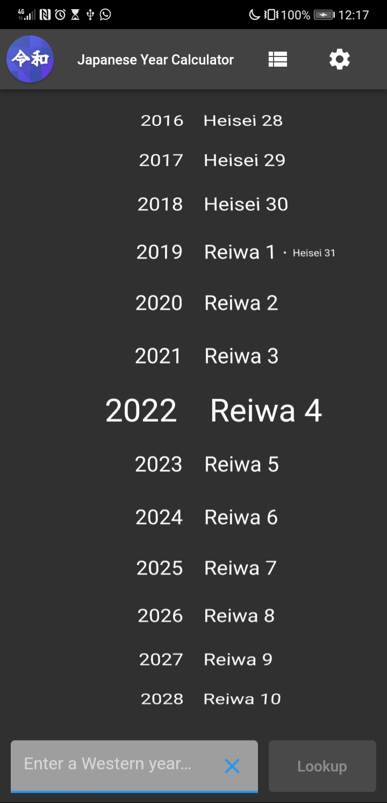
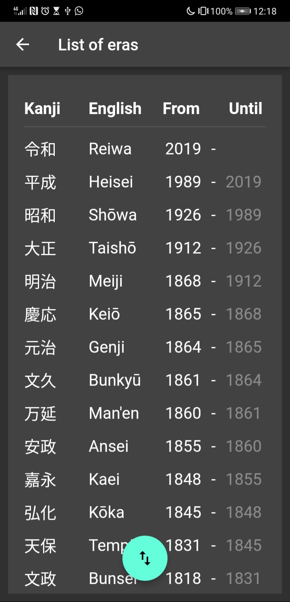
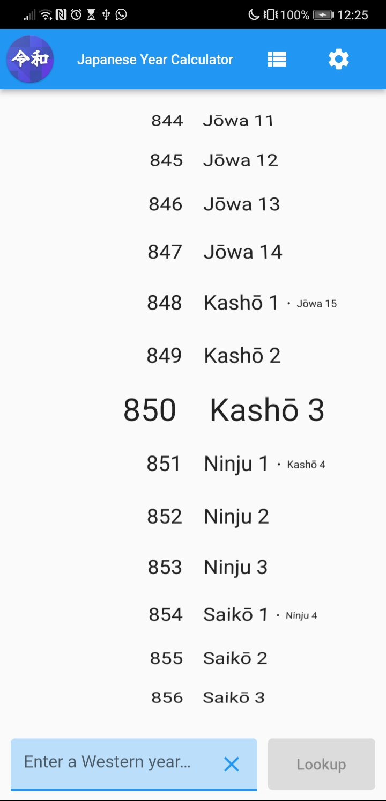

# japanese_year_calculator

A simple Flutter app that converts between Japanese and Western years.






---

## Development

### State management

This app follows the Flutter Skeleton 2.0 which uses traditional
state management (passing controllers down the Widget tree).

The [SettingsController] manages settings changes, persisting them
to SharedPreferences, and broadcasting change notifications.

[AnimatedBuilders] are used to listen to [ChangeNotifier] objects
and rebuild widgets. This is used in two places: a) to rebuild the
entire app whenever a setting changes, and b) to enable or disable
the 'Lookup' button based on the validity of the year input box.

### Directory layout

```
lib/src/(feature)            - Feature code (controller, service, view, widget)
lib/src/localization         - Localized messages
lib/src/core                 - Calculator logic (pure Dart)
lib/src/themes.dart          - Theming
lib/src/app.dart             - App routing
lib/main.dart                - App entry point
test/                        - Unit and widget tests
```

## Localization

This project generates localized messages based on arb files found in
the `lib/src/localization` directory. Currently, English and Japanese
are supported, and the locale can be overriden via the settings page.

Localization files are regenerated as part of the hot reload process,
and can be manually run via `flutter pub get`.
